# Part 1 – Introduction to Footprinting

## Objective

I want to learn about the basics of footprinting and how to gather information about a target.
I need to understand what is the difference between active reconnaissance. 
I also want to learn how to get information about a target from publicly available sources.

---

# What is Footprinting?

Footprinting is when you collect information about a target organization or system before you test its security. It is the step in ethical hacking. 
This helps the person doing the testing understand the targets environment. 
Footprinting is like gathering clues about the target.

---

# Types of Footprinting

### Passive Footprinting

You collect information without talking to the target

Examples:

- I use Google Search to find information

- I check WHOIS to see who owns a domain

- I look at Social Media to see what people are saying

- I read Public Documents to learn more

- I check DNS Records to see what is connected

---

### Active Footprinting

You collect information by talking to the target

Examples:

- I use DNS Queries to ask for information

- I use Ping to see if the target is alive

- I use Port Scanning to see what ports are open

- I use Banner Grabbing to see what software is running

---

## 1. Verify Internet Connectivity

### Scenario

Before I start looking for information I need to make sure my system is connected to the internet.

### Command

```bash

ping -c 4 google.com

```

### Description

This command sends four messages to Google to see if I can get a response. If I get a response then I know I have internet access. Footprinting needs internet access to work.

### Screenshot

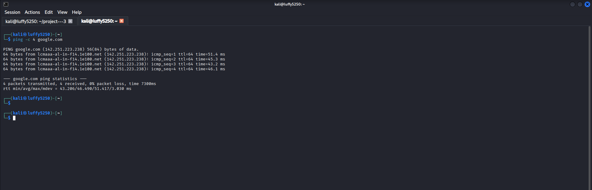

---

## 2. Perform a Basic DNS Lookup

### Scenario

I want to find the IP address of a domain name.

### Command

```bash

host openaai

```

### Description

This command shows me the IP addresses that are connected to the domain name. This is important for footprinting because it helps me understand the targets network.

### Screenshot

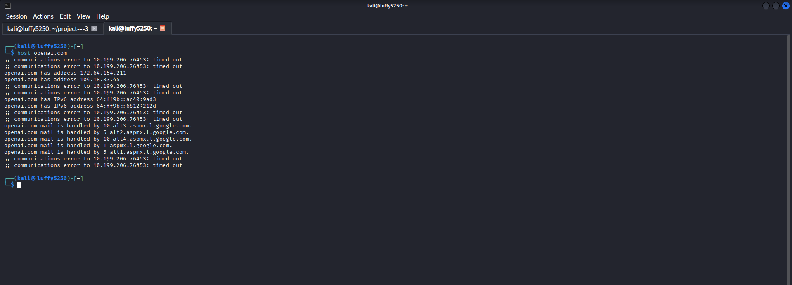

---

## 3. Query DNS Information

### Scenario

I want to get information about a domains DNS records.

### Command

```bash

dig google.com

```

### Description

This command asks the DNS server for information about the target domain. It shows me the DNS records, which's useful for footprinting. Footprinting is about collecting information like this.

### Screenshot

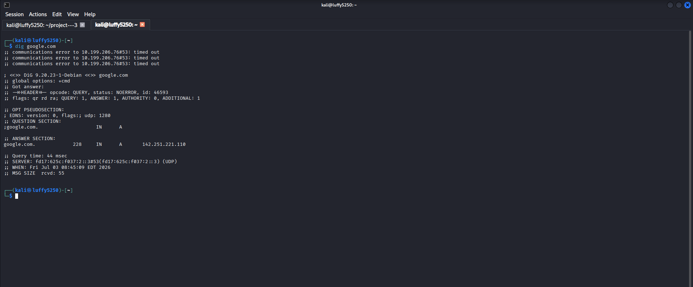

---

## Key Concepts Learned

- What Footprinting is and why it is important

- Why Footprinting is the first step in ethical hacking

- The difference between Passive and Active Footprinting

- Why looking for information is crucial

- How to check if I have internet access

- How to find the IP address of a domain name

- How to get basic DNS information

---

# Conclusion

In this part, I learned:

- The purpose of Footprinting.
- Passive vs Active Footprinting.
- How to verify internet connectivity using `ping`.
- How to resolve domain names using `host`.
- How to retrieve DNS information using `dig`.


--------------------------------------------------------------------------------------------------------------------------------------------------------------------------------------------------------------------------------

# Part 2 – Search Engine Footprinting (Google Dorking)

## Objective

I want to learn how to use search engines to find information about a company without going to their website.

This is useful because it helps me find information that's available to the public without actually going to the companys systems.

---

# What is Google Dorking?

Google Dorking is a way to use Googles search tools to find information that's not easy to find.

Google Dorking is also called Google Hacking.

People who are trying to help companies protect themselves from hackers use Google Dorks to find files and pages that should not be available to the public.

> **Note:** I should only use Google Dorking on systems that I own or have permission to use.

---

## 1. Find Indexed Pages

### Scenario

I want to know how many pages of a website are indexed by Google.

### Google Dork

```text

site:example.com

```

### Description

This Google Dork shows me all the pages of a website that Google has indexed.

Google Dorking is useful for this because it helps me see what information is available to the public.

### Screenshot


---

## 2. Search for PDF Documents

### Scenario

I want to find PDF documents that're available to the public on a website.

### Google Dork

```text

site:mit.edu filetype:pdf

```

### Description

This Google Dork helps me find PDF documents that are indexed by Google.

I can use Google Dorking to find all sorts of documents that're available to the public.

### Screenshot


---

## 3. Search for Word Documents

### Scenario

I want to find Microsoft Word documents that're available to the public.

### Google Dork

```text

site:example.com filetype:doc OR filetype:docx

```

### Description

This Google Dork helps me find Microsoft Word documents that are indexed by Google.

Google Dorking is a tool for finding documents that are available to the public.

### Screenshot


---

## 4. Search for Excel Files

### Scenario

I want to find Excel spreadsheets that're available to the public.

### Google Dork

```text

site:example.com filetype:xls OR filetype:xlsx

```

### Description

This Google Dork helps me find Excel spreadsheets that are indexed by Google.

I can use Google Dorking to find all sorts of files that're available to the public.

### Screenshot


---

## 5. Search for Login Pages

### Scenario

I want to find login pages that're available to the public.

### Google Dork

```text

site:example.com inurl:login

```

### Description

This Google Dork helps me find URLs that have the word **login** in them.

Google Dorking is useful for finding login pages that're available to the public.

### Screenshot


---

## 6. Search for Pages by

### Scenario

I want to find pages that have a title.

### Google Dork

```text

site:example.com intitle:"index"

```

### Description

This Google Dork helps me find pages that have the title I am looking for.

I can use Google Dorking to find pages with titles that are available to the public.

### Screenshot


---

## 7. Search for Public Directories

### Scenario

I want to find directory listings that're available to the public.

### Google Dork

```text

site:example.com intitle:"index of"

```

### Description

This Google Dork helps me find directory listings that are indexed by Google.

Google Dorking is useful for finding directory listings that're available to the public.

### Screenshot


---

## Key Concepts Learned

- Google Dorking is a way to use Google to find information that's available to the public.

- Search Operators are tools that help me find specific information.

- Indexed Pages are pages that Google has indexed.

- Public Documents are documents that are available to the public.

- Login Page Discovery is the process of finding login pages that are available to the public.

- Directory Listings are lists of files and directories that are available to the public.

- Passive Information Gathering is the process of gathering information without directly interacting with a system.

---

# Conclusion 

In this part I learned how Google indexes websites and how Google Dorking can help me find information that's available to the public.

I learned how to use Google Dorks to find available documents and login pages.

I also learned how to search for directory listings and use search operators to gather information.

Google Dorking is a tool for passive reconnaissance and can help me find information that is available, to the public.


---------------------------------------------------------------------------------------------------------------------------------------------------------------------------------------------------------------------


# Part 3 – WHOIS & Domain Information

## Objective

I want to learn how to find out information about a domain using the WHOIS protocol. The WHOIS protocol is one of the things I do when I am trying to figure out who owns a domain. I use it to find out who owns the domain when it was registered and what name servers it uses.

---

# What is WHOIS?

The WHOIS protocol is a way to get information about a domain name. It can tell me things like:

- The company that registered the domain

- When the domain was registered

- When the domain will expire

- When the domain information was updated

- What name servers the domain uses

- The status of the domain

- What country the person who registered the domain is from

> **Note:** Some domains have registration so I may not be able to see who actually registered the domain.

---

## 1. Perform a WHOIS Lookup

### Scenario

I want to find out information about a domain.

### Command

```bash

whois example.com

```

### Description

This command shows me all the information about the domain.

### Screenshot


---

## 2. Save WHOIS Output

### Scenario

I want to save the information about the domain so I can look at it later.

### Command

```bash

whois example.com > whois-report.txt

```

### Description

This command saves all the information about the domain to a file.

### Screenshot


---

## 3. View the Saved Report

### Scenario

I want to look at the information about the domain that I saved.

### Command

```bash

cat whois-report.txt

```

### Description

This command shows me all the information about the domain that I saved.

### Screenshot


---

## 4. Perform WHOIS Lookup for Another Domain

### Scenario

I want to compare the information about two domains.

### Command

```bash

whois openai.com

```

### Description

This command shows me all the information about the other domain.

### Screenshot


---

# Information That Can Be Collected

When I do a WHOIS lookup I can find out things like:

- The name of the domain

- The company that registered the domain

- When the domain was registered

- When the domain will expire

- When the domain information was last updated

- What name servers the domain uses

- If the domain uses DNSSEC

- The status of the domain

---

# Why WHOIS is Important

The WHOIS protocol is important for security professionals because it helps us:

- Figure out who owns a domain

- Find out how old a domain is

- Identify the company that registered the domain

- Find out what name servers a domain uses

- Gather information during a security assessment

---

# Key Concepts Learned

- The WHOIS protocol

- Registering a domain

- The company that registers a domain

- Name servers

- The life cycle of a domain

- Gathering information about a domain

---


# Conclusion

In this part, I learned:

- What WHOIS is.
- How to perform a WHOIS lookup.
- How to save WHOIS results.
- How to analyze domain registration information.
- How WHOIS supports the footprinting phase of ethical hacking.


-----------------------------------------------------------------------------------------------------------------------------------------------------------------------------------


# Part 4 – DNS Footprinting

## Objective

I want to learn how to gather information about a target domain using DNS lookup tools. This is called DNS footprinting. It helps me identify IP addresses, mail servers, name servers and other DNS records that're useful when I am trying to learn more about a domain.

---

# What is DNS Footprinting?

DNS Footprinting is the process of collecting information about a target domains DNS.

I can find out things like:

- IP Addresses

- Name Servers

- Mail Servers

- Text Records

- Canonical Names

- Start of Authority

---

## 1. Perform a Basic DNS Lookup

### Scenario

I want to find the IP address of a target domain.

### Command

```bash

nslookup example.com

```

### Description

This command asks the DNS server for the IP address of the domain.

### Screenshot


---

## 2. Query Name Server Records

### Scenario

I want to know which name servers are in charge of a domain.

### Command

```bash

dig NS example.com

```

### Description

This command shows me the Name Server records of the domain.

### Screenshot

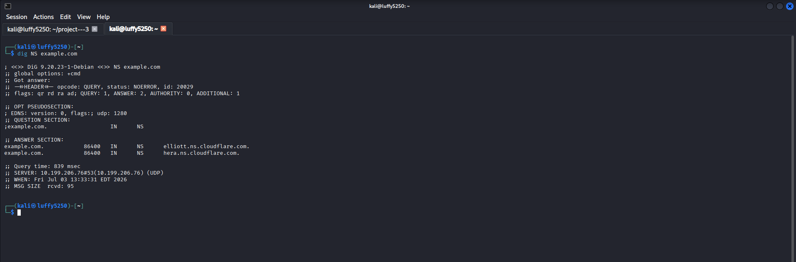

---

## 3. Query Mail Server Records

### Scenario

I want to know which mail servers handle email for a domain.

### Command

```bash

dig MX example.com

```

### Description

This command shows me the Mail Exchange records.

### Screenshot

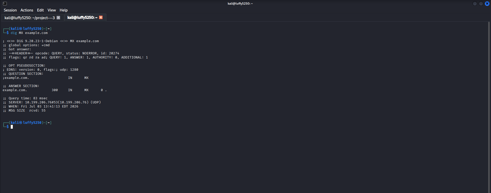

---

## 4. Query Text Records

### Scenario

I want to see the TXT records for a domain. These are used for things like verification and email security.

### Command

```bash

dig TXT example.com

```

### Ddig MX example.comescription

This command shows me the TXT records. These can include things like SPF, DKIM or domain verification entries.

### Screenshot

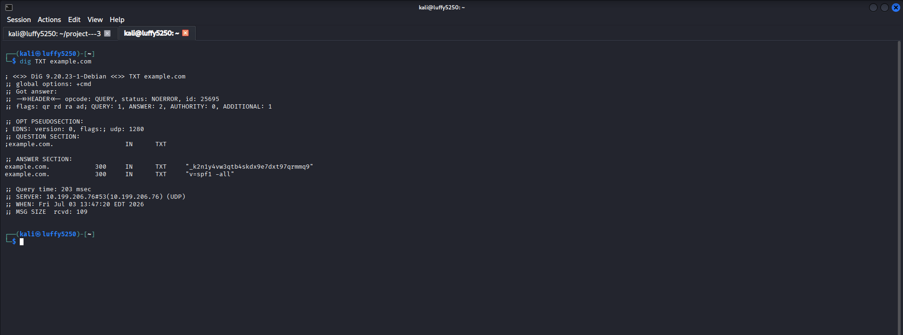

---

## 5. Query SOA Record

### Scenario

I want to know which DNS server is in charge and some administrative information.

### Command

```bash

dig SOA example.com

```

### Description

This command shows me the Start of Authority record for the domain.

### Screenshot

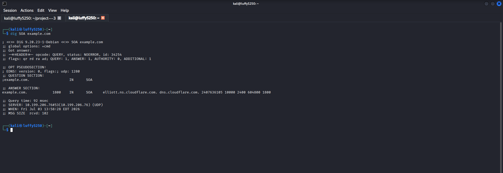

---

## 6. Perform DNS Footprinting, with dnsrecon

### Scenario

I want to collect lots of DNS record types at the time.

### Command

```bash

dnsrecon -d example.com

```

### Description

This command gives me lots of DNS information. This includes NS, MX, SOA and other DNS records.

### Screenshot

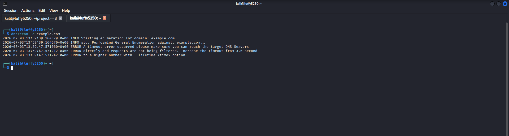

> **Note:** If `dnsrecon` is not installed I can install it using:

```bash

sudo apt install dnsrecon

```

---

# Key Concepts Learned

- DNS Footprinting

- DNS Records

- Name Servers

- Mail Servers

- TXT Records

- SOA Records

- DNS Enumeration

---

# Conclusion

In this part, I learned:

- How DNS supports the footprinting phase.
- How to retrieve DNS records using `nslookup` and `dig`.
- How to identify Name Servers and Mail Servers.
- How to examine TXT and SOA records.
- How to automate DNS footprinting using `dnsrecon`.


-----------------------------------------------------------------------------------------------------------------------------------------------------------------------------------------------------


# Part 5 – Website Footprinting

## Objective

I want to learn how to gather information about a website that's available to the public using special tools. Website footprinting helps me find out what technologies a website uses, what kind of server it has and other details that are publicly available without trying to hack into the website.

---

# What is Website Footprinting?

Website Footprinting is when I collect information about a website that's available to the public. This helps me understand what the website is made of and what technologies it uses.

I can find out things like:

- What kind of web server the website uses

- What operating system the website is on sometimes

- What kind of content management system the website uses

- What programming language the website is written in

- What security headers the website has

- What technologies the website uses

---

## 1. Identify Website Technologies

### Scenario

I want to find out what technologies a website is using.

### Command

```bash

whatweb https://example.com

```

### Description

This command helps me detect what technologies the website is using, like the web server, content management system and other things that I can see.

### Screenshot

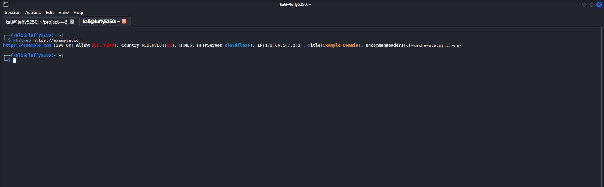

---

## 2. Retrieve HTTP Headers

### Scenario

I want to look at the HTTP headers that the website sends back.

### Command

```bash

curl -I https://example.com

```

### Description

This command shows me only the HTTP headers that the website sends back without loading the webpage.

### Screenshot

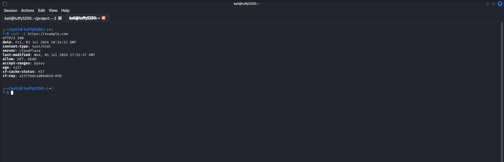

---

## 3. Download the Webpage Source

### Scenario

I want to get the HTML code of a webpage so I can look at it.

### Command

```bash

curl https://example.com

```

### Description

This command downloads the webpage. Shows me the HTML code.

### Screenshot

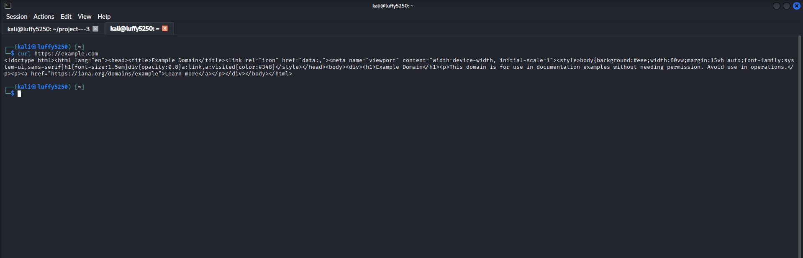

---

## 4. View SSL/TLS Certificate Information

### Scenario

I want to look at the SSL/TLS certificate that the website uses.

### Command

```bash

openssl s_client -connect example.com:443

```

### Description

This command shows me the certificate details and how the website sets up a connection.

### Screenshot


> I need to press **Ctrl + C** after I see the certificate information.

---

## 5. View Website Security Headers

### Scenario

I want to check if the website has the security headers.

### Command

```bash

curl -I https://example.com | grep -i security

```

### Description

This command looks for security headers in the websites response.

### Screenshot


---

## Key Concepts Learned

- Website Footprinting

- Technology Fingerprinting

- HTTP Headers

- HTML Source Analysis

- SSL/TLS Certificates

- Security Headers

---

# Conclusion

In this part, I learned:

- How to identify website technologies.
- How to inspect HTTP response headers.
- How to retrieve webpage source code.
- How to inspect SSL/TLS certificates.
- How website footprinting supports reconnaissance during ethical hacking.


----------------------------------------------------------------------------------------------------------------------------------------------------------------------------------------------------


# Part 6 – Email & Social Media Footprinting

## Objective

Learn how to gather information about an organizations email addresses and social media presence using online search techniques.

---

# What is Email & Social Media Footprinting?

Email and Social Media Footprinting is collecting information from email addresses, company websites and social media platforms that is available to anyone.

Security professionals use this information to understand an organizations presence and find potential weak spots.

Examples of information that can be collected include:

* Public email addresses

* Employee names

* Company departments

* Job roles

* Social media profiles

* Public contact information

> **Note:** Only collect information that's available to anyone and only for organizations you are allowed to assess or for learning purposes.

---

## 1. Collect Public Email Addresses

### Scenario

Find email addresses associated with a domain that're available to anyone.

### Command

```bash

theHarvester -d example.com -b hckertarget

```

### Description

Searches Bing for email addresses related to the target domain that are publicly indexed.

### Screenshot


---

## 2. Collect Email Addresses Using DuckDuckGo

### Scenario

Use a search engine to find publicly available email addresses.

### Command

```bash

theHarvester -d example.com -b duckduckgo

```

### Description

Searches DuckDuckGo for information associated with the target domain that's publicly available.

### Screenshot


---

## 3. Search LinkedIn for Public Employee Profiles

### Scenario

Find employee profiles for an organization that're visible to anyone.

### Search Query

```text

site:linkedin.com "Example" employees

```

### Description

Uses Google to find LinkedIn employee profiles that are publicly indexed.

### Screenshot


---

## 4. Search GitHub for Public Organization Repositories

### Scenario

Find GitHub repositories belonging to an organization that're publicly available.

### Search Query

```text

site:github.com example

```

### Description

Searches Google for public GitHub repositories related to the organization.

### Screenshot


---

## 5. Search for Public Contact Pages

### Scenario

Find company contact information that's publicly available.

### Search Query

```text

site:example.com contact

```

### Description

Searches for contact pages that may contain email addresses, phone numbers and office locations.

### Screenshot


---

# Tools Used

* theHarvester

* Google Search

* LinkedIn

* GitHub

---

# Key Concepts Learned

* Email Footprinting

* Social Media Footprinting

* OSINT

* Public Email Enumeration

* Employee Profiling

* Public Organization Information

---

#  conclusion

In this part I learned:

* How to identify available email addresses.

* How search engines can help with investigations.

* How to find visible employee profiles on LinkedIn.

* How GitHub can provide information, about an organization.

* How contact pages can help with gathering information.


